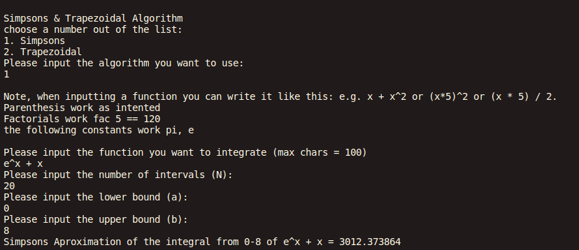
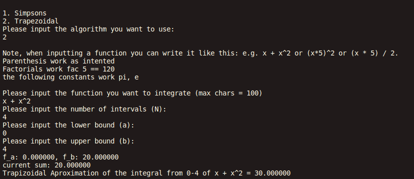

# Simpsons-Trapezodial-Rules
 
This is a C program that uses the tinyexpr library to parse through mathmatical functions, and then uses the Simpsons Trapezodial Rule to approximate the area under the curve.

## Description

- This program asks for user input on the number of intervals, the upper and lower bounds, and the function, and which approximation method to use.
- Depending on what the user chooses, program will approximate with either simpsons or trapezoidal rule, and parse through the function using tinyexpr library
- The program supports 
  - e.g. x + x^2 
  - (x*5)^2
  - (x * 5) / 2 
  - Factorials fac 5 == 120
  - the following constants pi, e

## Getting Started

### Dependencies
* Linux based system: containing gcc compiler
* Standard gcc Libaries Needed: stdio.h, string.h, ctype.h, math.h, and stdlib.h
* custom library: tinyexpr.h

### Installing & Executing

* First you need to clone this repo
* then run this command
```
gh repo clone Betim-Hodza/Movie-Theater-Management-System
cd SimpsonsAndTrapezoidal
gcc main.c tinyexpr-master/tinyexpr.c -lm
./a.out
```




## Authors

Betim Hodza 

## Sources
Tinyexpr:
- https://github.com/codeplea/tinyexpr